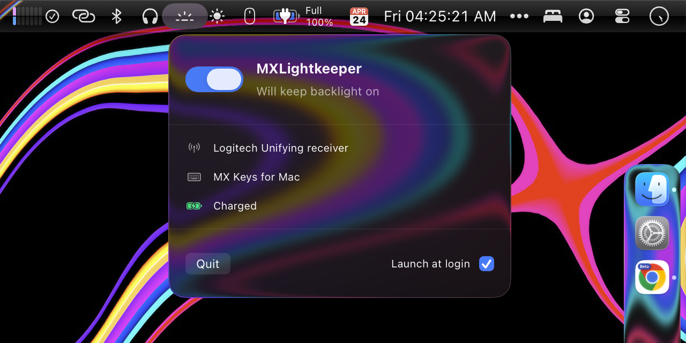

# MXLightkeeper

A macOS menu bar utility that keeps the backlight on your Logitech MX Keys keyboard from ever timing out.



> Verified on MX Keys for Mac over a Logitech Unifying receiver. Bolt receivers and other MX Keys variants are enabled too, but stay labeled `(alpha)` until confirmed on real hardware.

## Why

The MX Keys switches off its own backlight after a short period of inactivity. When the keyboard is permanently plugged into power and used with a USB Unifying or Bolt receiver, there's no real need for that — the light just comes on late, when you start typing, which is undesirable for people in darker environments who need to type in their password for macOS login. MXLightkeeper periodically refreshes the backlight state through the Logitech HID++ protocol so the light stays lit as long as the app is running.

This is a macOS port of the Windows [Backlighter](https://github.com/crsten/backlighter) utility, rewritten to use the real HID++ `BACKLIGHT2` feature rather than the original periodic off/on pulse.

## Install

Build the `.app` bundle:

```bash
chmod +x scripts/build-app-bundle.sh
scripts/build-app-bundle.sh
cp -R dist/MXLightkeeper.app /Applications/
```

Open it from `/Applications`, toggle **Keep backlight on**, and optionally enable **Launch at login**.

## Terminal tool

`mxlightkeeper` is a companion CLI for scripting or one-off control. The menu bar app and CLI both call the same `MXLightkeeperCore` engine rather than maintaining separate HID implementations.

```bash
swift build -c release --product mxlightkeeper
cp .build/release/mxlightkeeper /usr/local/bin/

mxlightkeeper read                 # print current BACKLIGHT2 state
mxlightkeeper on                   # turn backlight on
mxlightkeeper off                  # turn backlight off
mxlightkeeper manual --level 7     # set manual brightness 1-7
mxlightkeeper keep                 # run keep-alive loop until Ctrl-C
```

Only one MXLightkeeper process can own the long-running keep-alive loop at a time. If the menu bar app or another CLI process is already keeping the backlight alive, `mxlightkeeper keep` refuses to start instead of clashing.

## Requirements

- macOS 15+
- A Logitech Unifying (`0x046d:0xc52b`) or Bolt (`0x046d:0xc548`, alpha) receiver paired with an MX Keys family keyboard
- To build from source: Xcode 16.4+ / Swift 6+

Only "MX Keys for Mac" on Unifying has been end-to-end verified. Other MX Keys variants, Bolt receiver paths, and macOS 15 Sequoia support are enabled, but shown as `(alpha)` until confirmed on real hardware.

## How it works

The matched Logitech receiver exposes a vendor-specific HID interface on usage page `0xFF00`. A HID++ `getFeatureID` request resolves feature `BACKLIGHT2 (0x1982)` to feature index `0x0b` on the reference MX Keys for Mac setup. Both frontends call the same shared core controller, and the keep-alive loop writes the structured `BACKLIGHT2` state (`enabled = 1`, preserving the user's brightness level and mode) every 180 seconds.

In parallel, every 60 seconds a background poll re-reads `DEVICE_NAME (0x0005)` and `BATTERY_STATUS (0x1000)` from the keyboard to surface the model name and charge / charging state in the menu, and re-enumerates the receiver so unplug / replug is noticed automatically. The poll runs regardless of whether the keep-alive toggle is on. Long-running keep-alive ownership is exclusive, so the app and CLI do not both try to refresh the receiver at once.

See [`docs/reverse-engineering.md`](docs/reverse-engineering.md) for protocol details and how the feature indexes were discovered.

## Layout

- `Sources/MXLightkeeperCore/` — receiver matching, HID++ types, `BACKLIGHT2` codec, shared controller, exclusive keep-alive loop
- `Sources/MXLightkeeperApp/` — SwiftUI menu bar frontend
- `Sources/mxlightkeeper/` — terminal frontend over the shared core
- `Tests/MXLightkeeperCoreTests/` — unit tests for the core module
- `Packaging/` — `Info.plist` and pre-rendered `AppIcon.icns`
- `scripts/build-app-bundle.sh` — builds and signs the `.app` bundle

## Permissions and security

MXLightkeeper talks to the Logitech receiver's vendor-specific HID interface only (usage page `0xFF00`, not a keyboard interface). It does not read keystrokes, request Accessibility or Input Monitoring, or make any network calls. It does query the keyboard for its model name, battery level, and charging state via HID++ — all of which are read on the same vendor-specific interface and do not trigger TCC prompts.

**First-time launch.** The released `.app` is ad-hoc signed, not notarized. If you build from source locally (`scripts/build-app-bundle.sh`) Gatekeeper is fine. If you downloaded a prebuilt `.app`, right-click -> **Open** the first time, or run:

```bash
xattr -dr com.apple.quarantine /Applications/MXLightkeeper.app
```

**Login items.** Enabling "Launch at login" shows a standard macOS notification and adds MXLightkeeper to **System Settings → General → Login Items**.

**Terminal tool.** All `mxlightkeeper` subcommands use the same shared core and operate on the receiver's vendor-specific HID interface (usage page `0xFF00`), which macOS does not classify as keyboard input. No TCC prompts are expected. `mxlightkeeper keep` also respects the single-owner keep-alive guard and refuses to start if another MXLightkeeper process already owns the loop.

## License

MIT — see [`LICENSE`](LICENSE).

## Support

If this saves you from staring at a dim keyboard, you can [buy me a coffee](https://ko-fi.com/casualdeveloper11).
